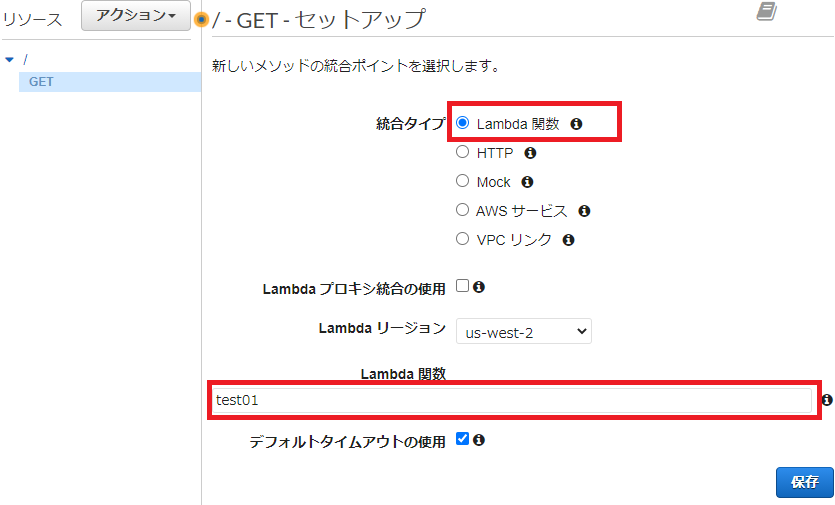

# AWS Lambda でサーバサイドレンダリング 基礎編

パラメータ無しで `GET リクエスト`されたときに、動的に生成されたHTMLを返す仕組みを `AWS Lambda` + `API Gateway` で実装します。

`GET`の`クエリパラメータ`や`パスパラメータ`、`POST` などのパラメータ付きリクエストは、応用編で紹介します。


# Lambda レイヤー準備
AWS Lambda の Node.js ランタイムで npm モジュールを利用するため、レイヤーを作成します。

[ドキュメント-Lambda レイヤーの作成と共有](https://docs.aws.amazon.com/ja_jp/lambda/latest/dg/configuration-layers.html)

**※以下は AWS CloudShell で作業します。**

[ドキュメント-CLI aws lambda publish-layer-version](https://docs.aws.amazon.com/cli/latest/reference/lambda/publish-layer-version.html)

## EJS - Embedded JavaScript templating
[EJS](https://ejs.co/)

```
#
# AWS ドキュメントに沿ったパス作成
$ mkdir nodejs
$ cd nodejs

#
# パッケージインストール
$ npm install ejs --save

#
# レイヤー用 Zip ファイル作成
$ cd ..
$ zip -r layer1.zip ./nodejs

#
# レイヤー作成
aws lambda publish-layer-version \
 --layer-name ejs \
 --description "EJS Embedded JavaScript templating" \
 --zip-file fileb://./layer1.zip \
 --compatible-runtimes nodejs12.x nodejs14.x

# {結果のJSON が出力される}

#
# 後片付け
$ rm -rf nodejs/
$ rm layer1.zip
```

# ソースコード準備

## ejs テンプレートソース
HTML をレンダリングする際に使用するテンプレートを準備します。

`name` が変数です。サーバ側で値をセットしてレンダリングされた HTML がブラウザに返されます。

```view.ejs
<!DOCTYPE html>
<html>
<head>
  <meta http-equiv="Content-Type" content="text/html; charset=UTF-8">
  <meta name="viewport" content="width=device-width,initial-scale=1">
</head>
<body>
Welcome my page!! <%= name %>
</body>
</html>
```

## Lambda 内部にテンプレート配置
## 構成図


## テンプレート配置方法
1. AWS Lambda のWebコンソールから 「ソースコード」のエリアで、ソースコードエディタの左側にあるツリーのルートディレクトリ部分を右クリックします。

1. コンテキストメニューが表示されるので「New File」を選択します。

1. 新しく [Untitled] というファイルがツリーに作成されるので `view.ejs` というファイル名に変更します。

1. `view.ejs` に、[テンプレートソースコード](#ejs-テンプレートソース)を貼り付けて保存します。


## ソースコード
```index.js
var ejs = require("ejs");

function getTemplateBufferFromLocal()
{
    return ejs.fileLoader("view.ejs",'utf-8'); 
}

exports.handler = async (event) => {
    var ejsBuffer = getTemplateBufferFromLocal();

    const response = {
        statusCode: 200,
        body: ejs.render(ejsBuffer, {name: "hogehoge"} ),
        "headers": {
            "Content-Type": "text/html"  
        },
    };
    return response;
};
```

## S3 にテンプレート配置
## 構成図


## テンプレートファイル配置
S3 バゲットを作成し、テンプレートファイルを配置します。

## IAM ロール
作成されたLambda ロールに `S3ReadOnlyAccess` を付ける

## ソースコード
```index.js
var ejs = require("ejs");
// AWS SDK 
var AWS = require('aws-sdk');
AWS.config.update({region : 'us-east-1'});   // リージョン指定(追々環境変数にする？)

// S3 Service オブジェクト
var S3 = new AWS.S3({apiVersion: '2006-03-01'});
// S3 オブジェクトを文字列に
var Buffer = require("buffer").Buffer;

async function getTemplateBufferFromS3(pageId)
{
    var params = {
      Bucket : "", // ご自身のバゲット名を指定
      Key : `view/${pageId}.ejs`
    };
    
    return new Promise((resolve, reject) => 
    {
        S3.getObject(params, (err, data) =>
        {
            if( err )
            {
                reject(err);
            } else {
                var buf = Buffer.from(data.Body);
                var strBuf = buf.toString();
                resolve(strBuf);
            }
        });
    });
}

exports.handler = async (event) => {
    var ejsBuffer = await getTemplateBufferFromS3();

    const response = {
        statusCode: 200,
        body: ejs.render(ejsBuffer, {name: "hogehoge"} ),
        "headers": {
            "Content-Type": "text/html"
        },
    };
    return response;
};
```
# AWS Lambda テスト (Lambda 内部に配置／S3 に配置共通)
## node.js ソースコード解説

>         body: ejs.render(ejsBuffer, {name: "hogehoge"} ),
この一行で、サーバサイドレンダリングを実現しています。
ejsBuffer 変数には、テンプレートファイルのコードが格納されています。
`name` という変数に対して、"hogehoge" という文字を割り当てるようにレンダリングしています。

`render` メソッドの第２引数は json 形式なので、複数の変数に対して値を割り当てるように指示することもできます。

## テスト
1. AWS Lambda のWebコンソールから `[Test]` ボタンをクリックします。

1. 「テストイベントの設定」ダイアログで、テストパラメータを空にして保存します。

1. ダイアログが閉じたら、もう一度 `[Test]` ボタンをクリックし、テストを実行します。
1. 「Execution result」タブが表示され、`Response` に以下の結果が出力されていることを確認します。

```
{
  "statusCode": 200,
  "body": "<!DOCTYPE html>\n<html>\n<head>\n  <meta http-equiv=\"Content-Type\" content=\"text/html; charset=UTF-8\">\n  <meta name=\"viewport\" content=\"width=device-width,initial-scale=1\">\n</head>\n<body>\nWelcome my page!! hogehoge\n</body>\n</html>",
  "headers": {
    "Content-Type": "text/html"
  }
}
```
テンプレートファイル(view.ejs)のなかで `<%= name%>` だった部分が、node.js プログラムで設定した **hogehoge** として出力されます。

# API Gateway
## 準備
API Gateway では `REST API` を作成します。


### プロトコルを選択する 画面

以下の通りに設定します。
- REST/Web Socket は、`REST` を選択します
- 「新しい API の作成」 `新しいAPI` を選択します。
- 「名前の説明 API 名」 は任意の名前を入力します。
- 「名前の説明 エンドポイントタイプ」 は、`リージョン`


## GET メソッド作成
新しい Webメソッドを作成します。API リソース画面上部の「アクション」から「メソッドの作成」を選択します。


### GET セットアップ 画面
以下の通りに設定します。

- 統合タイプ : Lambda 関数
- Lambda プロキシ統合の使用 : チェック無し
- Lambda リージョン : 変更なし
- Lambda 関数 : [ソースコード準備](#ソースコード準備)で用意した Lambda 関数名



「保存ボタン」をクリックすると、API Gateway が Lambda 関数を呼び出す権限について、確認ダイアログが表示されるので「Okボタン」をクリックします。

### メソッドレスポンス 設定
まず、ブラウザに返送する情報を制御する `メソッドレスポンス` を設定します。


1. メソッドレスポンスをクリックし 「HTTP のステータス」`200` を開きます。
1. 「200 の　レスポンス本文」に初期設定されている `application/json` を、「×」ボタンで削除します。
1. 「レスポンスモデルの追加」をクリックして、コンテンツに`text/html`、モデルに `Empty` を設定します。


### 統合レスポンス 設定
Lambda の戻り値を加工するための `統合レスポンス` を設定設定します。


1. メソッドレスポンスのステータス `200` 開きます。
1. 「マッピングテンプレート」を開きます。
1. Content-Type に初期設定されている `application/json` を「×」で削除します。


1. 「マッピングテンプレートの追加」をクリックし `text/html` を追加します。
1. 「テンプレートの生成」下部にソースコードを記述できるエリアがあるので下記のコードを貼り付けます。
1. 設定がすべて終わったら、画面下部の「保存」をクリックします。
```
#set($inputRoot = $input.path('$')) 
$inputRoot.body
```


## API テスト
「メソッドの実行」画面で `テスト` を選択します。


「メソッドテスト」画面で「テスト」ボタンをクリックし、「レスポンス本文」エリアに HTML が表示されたら成功です。


**※ JSON 形式で出力された場合は、[統合レスポンス](#統合レスポンス-設定)の設定が間違っている可能性があります。**

## API デプロイ
API をデプロイしてインターネットから利用できるようにします。

API リソース画面上部の「アクション」から「API のデプロイ」を選択します。


API のデプロイ先ステージを選択するダイアログが表示されるので、適切に設定します。初めてデプロイする場合はデプロイされるステージに `[新しいステージ]` を選択します。


デプロイが完了すると、API の URL が表示されるのでクリックします。


**[ejs テンプレートソース](#ejs-テンプレートソース)で作成したHTMLのページが表示されます！**

# まとめ
API Gateway + AWS Lambda を使って、サーバレスなサーバサイドレンダリング環境を実装することができました。テンプレートに準備した変数部分には、[Amazon RDS](https://aws.amazon.com/jp/rds/) などから取得した情報を表示することも可能になります。

続編として、もう少し高度なWebページとして、POST や パスパラメータに対応した API の実装手順を作成する予定です。